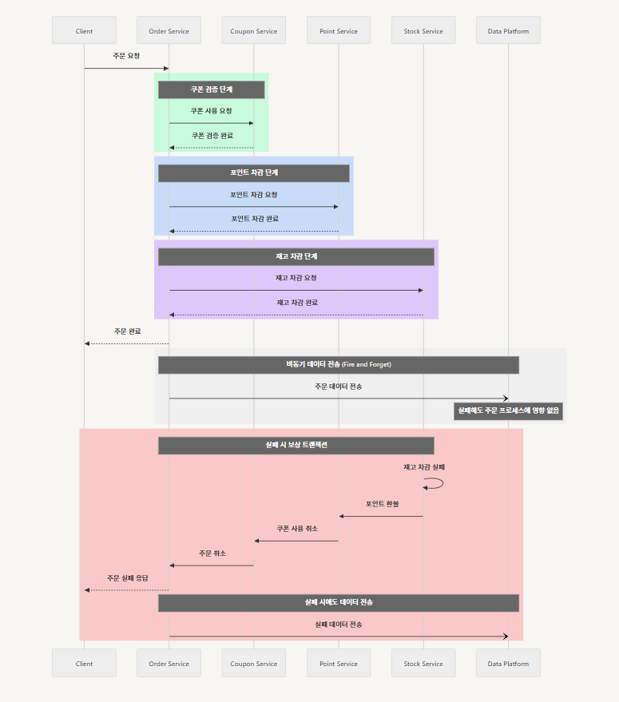
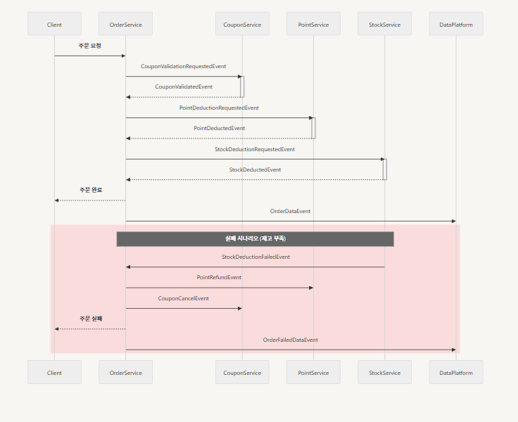

# MSA 적용 시 도메인 별 배포단위 분리에 따른 트랜잭션 처리 방안

# 사가 패턴

- 성공 시나리오:
    - 주문 시작 → 쿠폰 검증 → 포인트 차감 → 재고 차감 → 주문 완료

- 실패 시나리오 (재고 차감 실패의 예):
    - 재고 차감 실패 → 포인트 환불 → 쿠폰 사용 취소 → 주문 취소

- 특징
    - 각 단계는 독립적인 트랜잭션으로 처리
    - 실패 시 이전 단계들의 보상 트랜잭션이 역순으로 실행
    - 분산 환경에서도 데이터 일관성을 유지

- 장점
    - 각 서비스의 독립성 유지
    - 장애 격리
    - 점진적 롤백 가능

# 이벤트 기반 주문 처리 프로세스

## 1. 기본 처리 흐름

### 1.1 주문 단계별 처리

1. 주문 시작 (Order Created)
    - 쿠폰 검증 이벤트 발행
2. 쿠폰 검증 (Coupon Validated)
    - 쿠폰 사용 처리
    - 주문 금액 계산 이벤트 발행
3. 포인트 차감 (Point Deducted)
    - 포인트 잔액 확인 및 차감
    - 재고 확인 이벤트 발행
4. 재고 처리 (Stock Deducted)
    - 재고 차감
    - 주문 완료 이벤트 발행

## 2. 실패 처리

### 2.1 단계별 롤백 처리

- 쿠폰 실패 → 주문 취소
- 포인트 실패 → 쿠폰 복구 + 주문 취소
- 재고 실패 → 포인트 복구 + 쿠폰 복구 + 주문 취소

